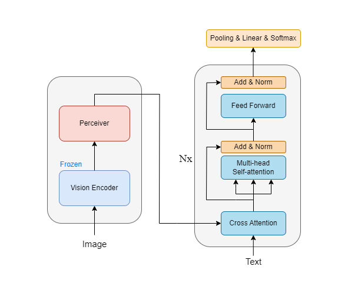

# Multimodal-Sarcasm-Detection
## Overview
* Placed cross-attention layer within each transformer layer to capture relationships between text and image.
* Explored various loss functions and implemented advanced techniques to address class imbalanced.

